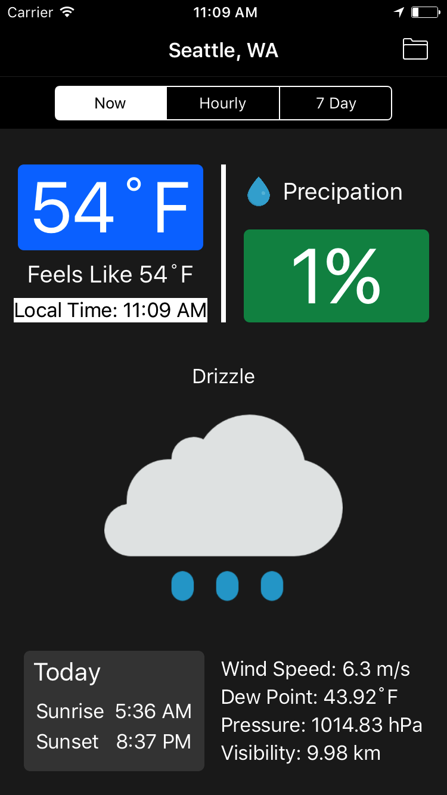
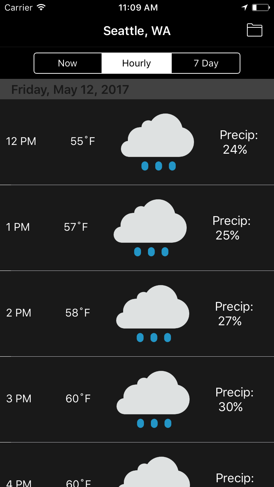
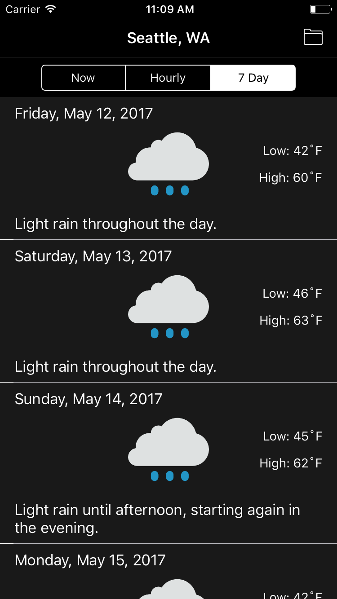

# nebulous
A weather application for iOS written in Objective-C.

### Description
nebulous is a weather application that aims to provide weather data in a clean, pristine, and informative manner. With nebulous, see the current weather, as well as the weather for the next 24 hours and the week ahead.

### Tools
 * Core Location - Used to obtain the latitude and the longitude based on the user's location as well as the latitude and the longitude from search terms.
 * Dark Sky API -  Uses the latitude and the longitude to retrieve the relevant weather information.

### Developer Stories
* As a developer, I want to provide a smooth, intuitive user experience.
* As a developer, I want to provide a clean, delightful, and concise UI.
* As a developer, I want to provide weather information using the user's location as well as any location he or she searches for.

### User Stories
* As a user, I want the weather for my current location as well as other locations.
* As a user, I want to be able to save my favorite places so that I can easily see what the weather at any of my favorite locations is like at a glance.
* As a user, I want to be presented with a clean, informative weather forecast.

### Screenshots
Home Screen | Check the hourly forecast | See the week ahead
:----------------------------:|:----------------------------: | :------:
 |    | 

### Instructions
Select the weather from the available options. Tap on 'Folder' icon at the top right to search for a new location or to view the weather from favorited locations.
### Authors
[Elyanil Castro](https://github.com/yanil3500)

[Cathy Oun](https://github.com/cathy810218)

### Art
[Shelly Oun]

### References
The application would not have been possible if not for the following resources:
* Forecastr - https://github.com/iwasrobbed/Forecastr
* AFN Networking - https://github.com/AFNetworking/AFNetworking
* Darksky API - https://darksky.net/dev/
